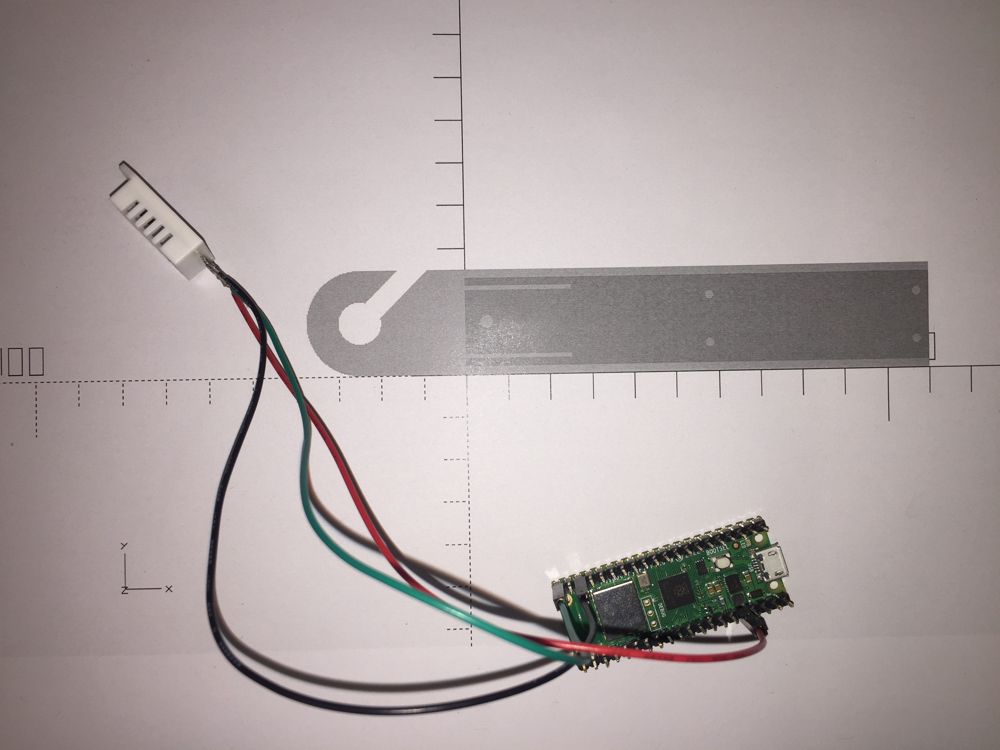

# dht22
Digital temperature and humidity reporting for the Raspberry Pi Pico, used to continuously monitor a server room at the Mechanical Engineering Campus of Leibniz University Hannover.

## Hardware Used
1. Raspberry Pi Pico
2. DHT22/AM2302 sensor
3. Wires/Breadboard
4. 3D-printed case (optional)

### Wiring
| Pi Pico Label | Purpose | DHT22 Pin |
|---------------|---------|-----------|
| 3V3           | Power   | 1         |
| GPIO 15       | Data    | 2         |
| GND           | Ground  | 4         |

### Notes
- Many variants of the DHT22 will have four pins. The third pin is unused.
- A pull-up resistor can be used but is not required, as the DHT22 has its own built-in.

## Install
By copying `main.py` to the Pico's on-board flash memory, it is executed at every boot.

Standard DHT drivers were [migrated](https://github.com/micropython/micropython/pull/9220) to `micropython-lib` starting with MicroPython 1.19, so most tutorials on the internet regarding this sensor no longer work!

The [dht](https://github.com/micropython/micropython-lib/blob/master/micropython/drivers/sensor/dht/dht.py) package can be copied over serial or installed OTA by modifying and executing `setup.py` on an internet-connected Pi Pico W. The library is should be saved to internal flash at `/lib`.

## Usage
A periodic timer is set to request sensor data every 3 seconds. The values are JSON encoded and printed over serial.[^1] The onboard LED will be on for the duration of this subroutine.

On most Linux hosts, the Pi Pico will be available under `/dev/ttyACM0`. The reading processes may need to part of the `dialout` group.

For an example implementation to read this data, see [dht22-nagios](https://github.com/j0hax/dht22-nagios).

### Connection Errors
If the wires are not soldered and knocked around, a connection may become flaky and a GPIO error can occur. Any errors when reading data are reported in the JSON's `error` attribute as a POSIX errno.

## Case

The 3D-Printed case can be used to mount the internals. It features a hook to hang the arrangement from the ceiling.

[OpenSCAD](https://openscad.org/) is used to model, customize and compile the final STL.

[^1]: Unfortunately, WPA2-EAP Networks such as eduroam are not supported very well by MicroPython at the moment.
